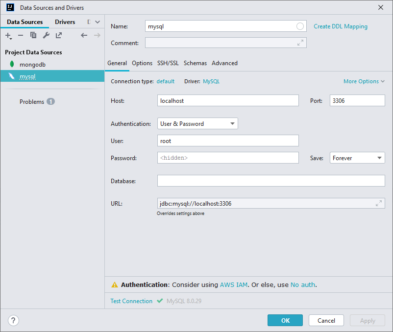
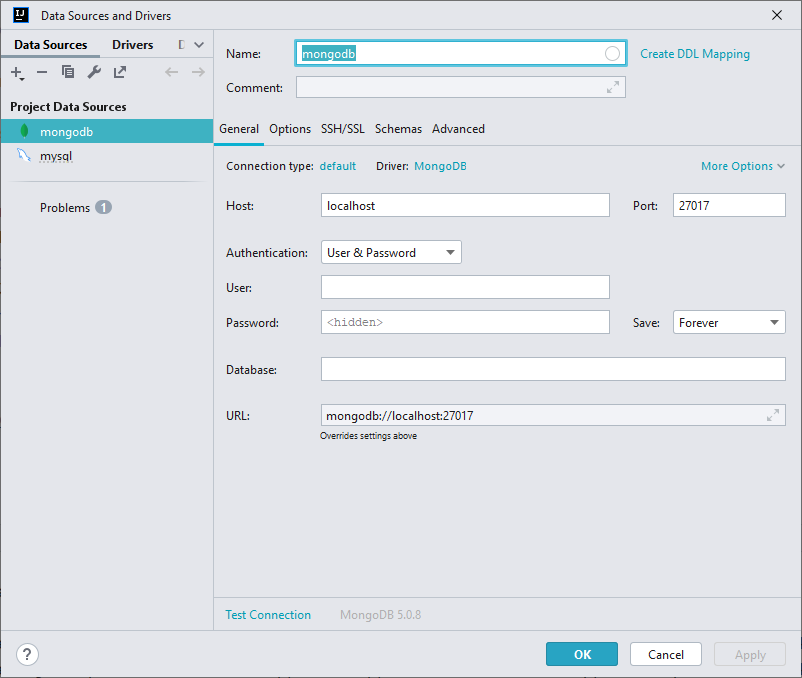
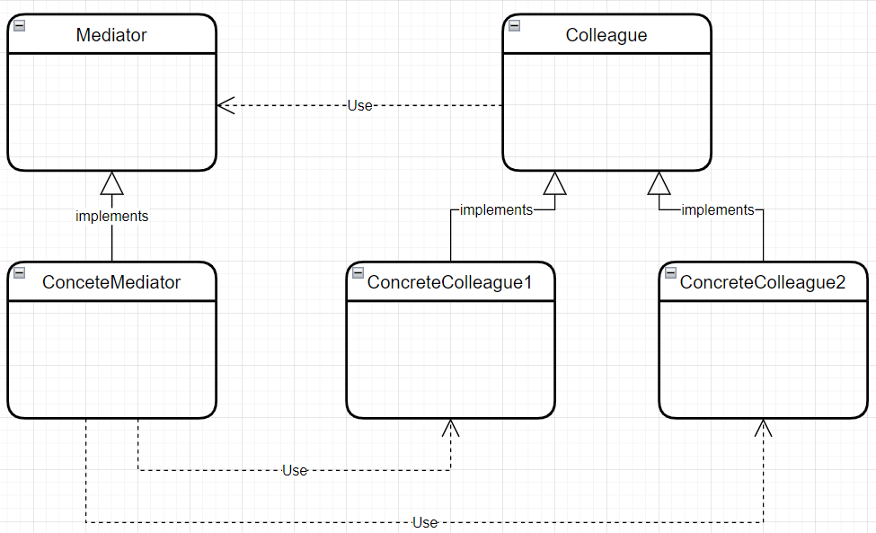
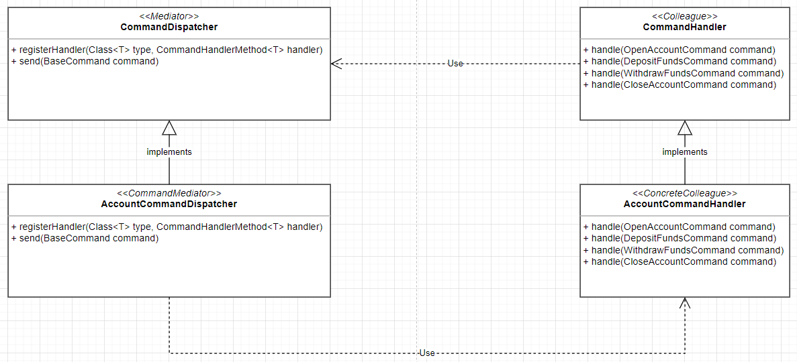

# Java Microservices: CQRS and Event Sourcing with Kafka
## A basic introduction to Microservices
Microservices are small, loosely coupled applications or services that can fail independently from each other. When a microservice fails, only a single process will function in the system and should become unavailable, while the rest of the system remains unaffected.
##### A few microservices principles:
- Microservices should not share code or data.
- Avoid unnecessary coupling between services and software components in a microservices architecture. We want to achieve low coupling and high cohesion. We're coupling refers to the degree of dependence, while cohesion refers to two most parts that work together to achieve better results.
- Independence and autonomy are more important than code re-usability.
- Each microservice should be responsible for only a single function or process in the system.
- Microservices should not communicate directly with each other. They should make use of an event or message bus to communicate with one another.
## What is CQRS and Event Sourcing
_CQRS (The Command and Query Responsibility Segregation)_ - Software Design Pattern
suggests that an application should be divided into a command and query part, in which commands alter the state of an object or entity. But queries retrieve the state of an object or entity.
### Why CQRS?
- Data is often more frequently queried than altered or vice versa.
- Segregating commands and queries enables us to optimize each for a high performance read and write.
- Read and write representations of data often differ substantially.
- Executing command and query operations on the same model can cause data contention.
- Segregating, read and write consents enables you to manage to read and write security.

_Event Sourcing_ - defines an approach where all the changes that are made to an object or entity are stored as a sequence of immutable events to an event store, as opposed to just saving the current state of the object or entity.
### Benefits of Event Sourcing
- The event still provides a complete log of every state change.
- The state of an object or aggregate can be recreated by replaying the event store.
- Improves write performance where all event types are simply appended to the event store. There are no update or delete operations.
- In the case of failure, the event still can be used to restore the read database.
## Architecture overview  (an example)

A client can, for example, make an open account command request to the Bank Account Command API.</br>
The Bank Account Command API will then, from its control method, use the command dispatch to dispatch the open account command to the relevant command handler method. This command handler method will then create a new account aggregate instance, which extends the aggregate route within the Account Aggregates Constructor. Once the open account command has been handled, it will raise the account open event that will alter the state of the aggregate. The command handler will then post the account aggregate object to the event sourcing handler that will persist, the uncommitted changes on the aggregate in the form of events via the events store. Once completed, it will mark the changes on the aggregate as committed. The events store, on the other hand, will be responsible for persisting new events to the event or via the events store repository.
And once an event has been successfully persisted to the event store, it will publish a new event to Kafka through the event publisher interface.</br>
On the query side, there will be an event consumer that subscribes to the account open event topic and once a new instance of the account open event is published to Kafka. It will consume it from Kafka and then pass it to the event handler. The event handler will then be responsible for handling the account opened event, whereby it will build up a bank account entity that will persist in the read database. Then on the query side, a client can, for example, make a find all accounts query request over to the bank account query restful API. The bank account query API will then, from its controller method, dispatch the query object via the query dispatcher to the relevant query hand the method. The query handler method will then handle the query and translated it into a query that will execute against the read database through the account repository. Once it has retrieved one or more bank account records from the Read database, it will return it via the query. Dispatch back to the controller method that will reply to the client with a list containing one or more bank account records.
## Prerequisites
- JDK 17
- Maven
- Docker Desktop
- Intellij IDEA
- Postman
- Kafka (event bus) is a distributed event streaming platform
- MongoDB (event source storage)
- MySQL (read storage)
#### Docker commands
1. Create network for our application that our containers will be able to
communicate with one another:
```shell
docker network create --attachable -d bridge techbankNet
```
- `-- atachable` means which will allow us to manually attach our containers to this network</br>
- `- d` specify our network driver as a bridge</br>
- `techbankNet` name for our network</br>
2. Perform the following command to check successfully created network
```shell
docker network ls
```
Expected output:
```commandline
NETWORK ID     NAME             DRIVER    SCOPE
f572cb6f1463   techbankNet      bridge    local
```
3. Find out in root project directory in folder `docker-compose.yml` file that contains description for starting kafka service.</br>
   Perform command:
```shell
docker-compose up -d
```
4. Perform the following command to check successfully started containers
```shell 
docker ps
```
Expected output:
```commandline
CONTAINER ID   IMAGE               COMMAND                  CREATED         STATUS         PORTS                                                  NAMES
3115adbe2f47   bitnami/kafka       "/opt/bitnami/script…"   3 minutes ago   Up 3 minutes   0.0.0.0:9092->9092/tcp                                 techbankNet_kafka
b11539e2333f   bitnami/zookeeper   "/opt/bitnami/script…"   3 minutes ago   Up 3 minutes   2888/tcp, 3888/tcp, 0.0.0.0:2181->2181/tcp, 8080/tcp   techbankNet_zookeeper
39d19506fe7c   mysql:latest        "docker-entrypoint.s…"   3 minutes ago   Up 3 minutes   0.0.0.0:3306->3306/tcp, 33060/tcp                      techbankNet_mysql
7e6eba6ab195   mongo:latest        "docker-entrypoint.s…"   3 minutes ago   Up 3 minutes   0.0.0.0:27017->27017/tcp                               techbankNet_mongodb
```
5. Using the Intellij Idea Database plugin set up connections for mysql and mongodb:


# Messages
## 3 types of messages in CQRS and ES: Commands, Events, Queries
### 1. What is a Command?
**Command** is a combination of expressed intent, in other words, something that you want to be done.
It also contains the information required to undertake action based on their content commands and named with a verb in the imperative mood. (For example, open a card command or deposit funds command.)
### 2. What is an Event?
**Event** describes something that happened in the application.
A typical source of events is the aggregate. 
When something important in the aggregate occurs, it will raise an event.
Events are always named in the Past article verb. (For example, account opened event or funds deposit to the event.)
### 3. What is a Query?
**Query** is another type of message object that is used to request data from the read database.

## CommandDispatcher Interface
During to create CommandDispatcher best to use Mediator Design Pattern (behaviour) that promotes loose coupling by preventing objects from referring to each other explicitly.</br>
It is used to simplify communication between objects in an application by introducing a single object known as the mediator that manages the distribution of messages, among other objects, and in the context of this section, messages or commands.</br>
### Mediator Desing Pattern
It is used to simplify communication between objects in an application by introducing a single object known as the mediator that manages the distribution of messages, among other objects, and in the context of this section, messages or commands.</br>
**Mediator** defines an interface for communicating with colleagues objects.</br>
**ConcreteMediator** class that implements the Mediator interface, which implements cooperative behavior by coordinating colleague objects.</br>
Each **Colleague** class is aware of its mediator object, and each Colleague class communicates with its mediator whenever it would have otherwise communicated with another colleague.

### Command Dispatching Mechanism
More specifically, our CommandDispatcher a mediator interface defines two methods one for registering a handler, which would be our CommandHandler a colleague and another for sending a command to CommandHandler.

In other words, the command dispatcher will be responsible for registering all of our different CommandHandlingMethods, and it will make sure that the various controller methods dispatch the command objects to the relevant account command handling methods.
## What is Aggregate?
An **aggregate** is an entity or group of entities that are always kept in a consistent state.</br>
The **Aggregate Root** is the entity within the aggregate that is responsible for maintaining this consistent state.</br>
This is what makes the aggregate the primary building block in any cqrs based application.
## What is an Event Store?
An **Event Store** is a database that is used to store the data as a sequence of immutable events over time.</br>
An **Event Store** is a key enabler of event sourcing and the following are key considerations when designing and event store:
- An **Event Store** must be an append only store. No update or delete operations should be allowed.
- Each event that is saved should represent the version or state of an aggregate at any given point in time.
- Events should be stored in chronological order and new events should be appended to the previous event.
- The state of an aggregate should be recreated bill by replaying the event store.
- The event store should implement optimistic concurrency control.
## Event Producer

- Kafka producer is used to send or produce messages to one or more Kafka topics. Kafka producers also serialized. This compresses and load balances data among Kafka brokers through partitioning.

- A Kafka broker is a server running in a Kafka cluster, usually in the form of a container. Kafka clusters are usually made up of one or more brokers. Having multiple Kafka brokers allows for load balancing redundancy and reliable fail over. Brokers are stateless and rely on Apache Zookeeper to manage the state of the cluster.
- Apache Zookeeper is thus responsible to manage the cluster and the election of the broker leader. It is advised to utilize a minimum of three brokers to achieve reliable fell over. However, a single broker can handle hundreds of thousands of messages without a performance impact.
- Topics are divided into partitions in a Kafka cluster, and partitions are replicated across brokers.
- Kafka topic as a channel through which event data is streamed, produces, always publishes or produces event messages to topics while consumers read messages from a topic that they subscribe to.
## Important DDD Principles
Domain Driven Development is an approach to structure and models software in a way that it matches the business domain. It places the primary focus of the software project on the core area of the business, also known as the code domain. It refers to problems as domains and aims to establish a common language to talk about those problems. It also describes independent problem areas as bounded contexts.
### Bounded Context
It's an independent problem area. It describes a logical boundary within which a particular model is defined and applicable. Each bounded context correlates to microservices. For example, the bank account microservice.
## Kafka Consumer

The producer produces FundsDepositEvent into Kafka once somebody deposits funds into a bank account.</br>
Kafka Commit Log starts with the offset zero. So, every time a producer produces a new event message to Kafka, it will append to the Kafka Log. Kafka tracks a separate offset for each consumer group that subscribes to the topic. The order is very important. Kafka will always append a new message to the end of the kafka log, and the order of events is extremely important for event sourcing.</br>
An Account Consumer used to consume FundsDepositedEvent and update the bank account read database.</br>
A Notification Consumer used for sending SMS to a customer when funds are deposited into his account.</br>
### Group ids
The reason that the notification consumer and account consumer offsets differ is because they group IDs are different. That is why the offsets are tracked separately. Kafka absolutely supports multiple instances running on the same consumer group. In other words, we could, for example, start up four instances of the notification consumer and Kafka.</br>
Just to clarify, a Kafka consumer must belong to a consumer group, and a consumer group can have one or more consumers. And then the offset is checked per consumer group and not per consumer.
## Query Dispatching
